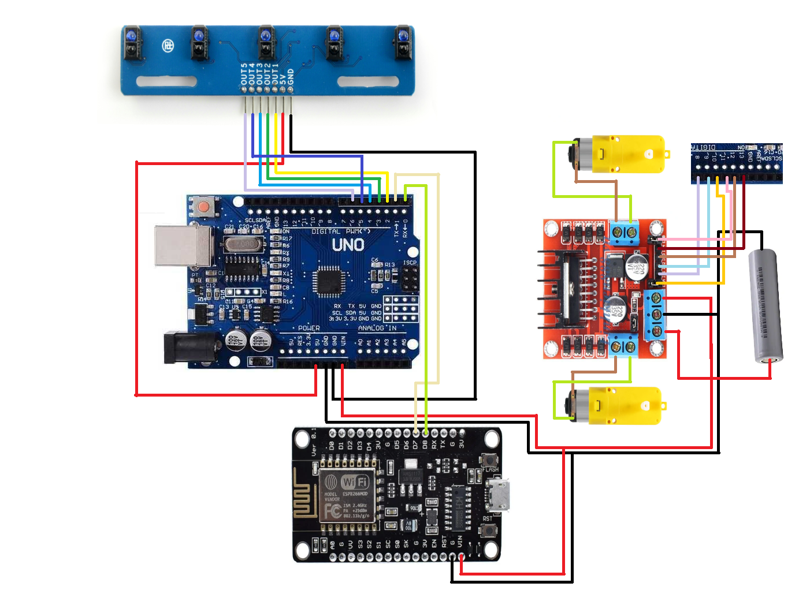

<!DOCTYPE html>
<html lang="en">
<head>
    <meta charset="UTF-8">
    <meta name="viewport" content="width=device-width, initial-scale=1.0">
</head>
<body>

<h1>Line Following Car with MQTT</h1>

Welcome to the Line Following Car project! This project utilizes MQTT to collect direction commands for a car built with NodeMCU, Arduino, a line sensor, and an L298 motor driver.

<h2>Table of Contents</h2>
<ul>
    <li><a href="#introduction">Introduction</a></li>
    <li><a href="#components">Components</a></li>
    <li><a href="#circuit-diagram">Circuit Diagram</a></li>
    <li><a href="#setup">Setup</a></li>
    <li><a href="#installation">Installation</a></li>
    <li><a href="#usage">Usage</a></li>
    <li><a href="#mqtt-configuration">MQTT Configuration</a></li>
    <li><a href="#contributing">Contributing</a></li>
    <li><a href="#license">License</a></li>
</ul>

<h2 id="introduction">Introduction</h2>

This project aims to build a line-following car controlled via MQTT. The car follows a predefined path using a line sensor and can receive direction commands through an MQTT broker. The main components include NodeMCU for MQTT communication, Arduino for processing sensor data, a line sensor for detecting the path, and an L298 motor driver for controlling the motors.

<h2 id="components">Components</h2>
<ul>
    <li>NodeMCU (ESP8266)</li>
    <li>Arduino (e.g., Arduino Uno)</li>
    <li>Line sensor module</li>
    <li>L298 motor driver</li>
    <li>DC motors</li>
    <li>Chassis for the car</li>
    <li>Wheels</li>
    <li>Power supply (battery)</li>
    <li>Connecting wires</li>
</ul>

<h2 id="circuit-diagram">Circuit Diagram</h2>

<h2 id="setup">Setup</h2>
<ol>
    <li><strong>Connect the Components</strong>:
        <ul>
            <li>Connect the line sensor to the Arduino.</li>
            <li>Connect the L298 motor driver to the motors, power supply, and Arduino.</li>
            <li>Connect the NodeMCU to the Arduino via serial communication.</li>
        </ul>
    </li>
    <li><strong>Arduino Setup</strong>:
        <ul>
            <li>Connect the line sensor to the Arduino analog pins.</li>
            <li>Connect the motor driver input pins to the Arduino digital pins.</li>
        </ul>
    </li>
    <li><strong>NodeMCU Setup</strong>:
        <ul>
            <li>Connect the NodeMCU to a Wi-Fi network.</li>
            <li>Set up serial communication between NodeMCU and Arduino.</li>
        </ul>
    </li>
</ol>

<h2 id="installation">Installation</h2>
<ol>
    <li><strong>Clone the Repository</strong>:
        <pre><code>git clone https://github.com/yourusername/line-following-car.git
cd line-following-car</code></pre>
    </li>
    <li><strong>Arduino Code</strong>:
        
Upload the <code>line_following_car.ino</code> file to your Arduino using the Arduino IDE.

    </li>
    <li><strong>NodeMCU Code</strong>:
        
Upload the <code>nodemcu_mqtt.ino</code> file to your NodeMCU using the Arduino IDE.

    </li>
    <li><strong>Libraries</strong>:
        
Ensure you have the required libraries installed in your Arduino IDE:

        <ul>
            <li><code>PubSubClient</code> for MQTT</li>
            <li><code>ESP8266WiFi</code> for NodeMCU</li>
        </ul>
    </li>
</ol>

<h2 id="usage">Usage</h2>
<ol>
    <li><strong>Power the Car</strong>:
        <ul>
            <li>Connect the power supply to the car.</li>
            <li>Ensure all components are powered and properly connected.</li>
        </ul>
    </li>
    <li><strong>MQTT Broker</strong>:
        <ul>
            <li>Set up an MQTT broker (e.g., Mosquitto).</li>
            <li>Note the broker’s IP address and port number.</li>
        </ul>
    </li>
    <li><strong>Start the Car</strong>:
        <ul>
            <li>Place the car on the line track.</li>
            <li>Power up the car and ensure it connects to the MQTT broker.</li>
        </ul>
    </li>
    <li><strong>Send MQTT Commands</strong>:
        <ul>
            <li>Use an MQTT client to send direction commands to the car. Commands can include:
                <ul>
                    <li><code>start</code> to begin following the line</li>
                    <li><code>stop</code> to halt the car</li>
                    <li><code>left</code> to turn left</li>
                    <li><code>right</code> to turn right</li>
                </ul>
            </li>
        </ul>
    </li>
</ol>

<h2 id="mqtt-configuration">MQTT Configuration</h2>

Configure the MQTT settings in the <code>nodemcu_mqtt.ino</code> file:

<pre><code>const char* ssid = "your_SSID";
const char* password = "your_PASSWORD";
const char* mqtt_server = "your_MQTT_BROKER_IP";
const int mqtt_port = your_MQTT_BROKER_PORT;
const char* mqtt_user = "your_MQTT_USERNAME";
const char* mqtt_password = "your_MQTT_PASSWORD";</code></pre>

<h2 id="contributing">Contributing</h2>

Contributions are welcome! Please fork the repository and submit a pull request with your changes. Ensure that your code adheres to the project’s coding standards and includes appropriate documentation.

<h2 id="license">License</h2>

This project is licensed under the MIT License. See the <a href="LICENSE">LICENSE</a> file for details.

</body>
</html>
